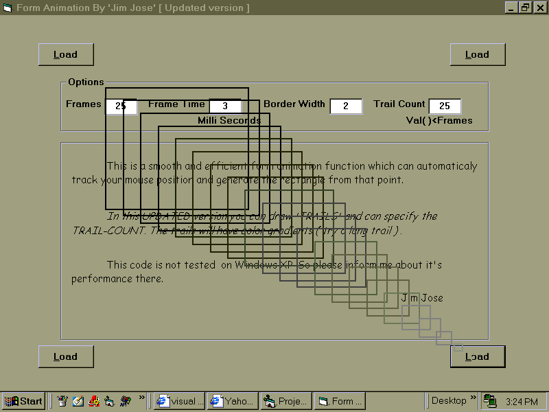



## \[ Yes\! The Transparent Rectangle Form Animation \] \- V3

### Description

Update-2.... Now there is no need of an additional form. This was my dream function which can animate your form with transparent rectangles during Loading and Unloading. This updated version can create trails for the form and with nicely gradiented colors and adjustable trail length. This function is powerful and works pefect. Thanks to Lavolpe for his great co-operation. Enjoy! and please leave your comments.
 
### More Info
 

             |
---                |---
**Submitted On**   |2004-01-08 19:59:44
**By**             |[JJJJJJJJ](https://github.com/Planet-Source-Code/PSCIndex/blob/master/ByAuthor/jjjjjjjj.md)
**Level**          |Beginner
**User Rating**    |4.6 (74 globes from 16 users)
**Compatibility**  |VB 6\.0
**Category**       |[Graphics](https://github.com/Planet-Source-Code/PSCIndex/blob/master/ByCategory/graphics__1-46.md)
**World**          |[Visual Basic](https://github.com/Planet-Source-Code/PSCIndex/blob/master/ByWorld/visual-basic.md)
**Archive File**   |[\[\_Wow\!\_The1858142272005\.zip](https://github.com/Planet-Source-Code/jjjjjjjj-yes-the-transparent-rectangle-form-animation-v3__1-59184/archive/master.zip)

